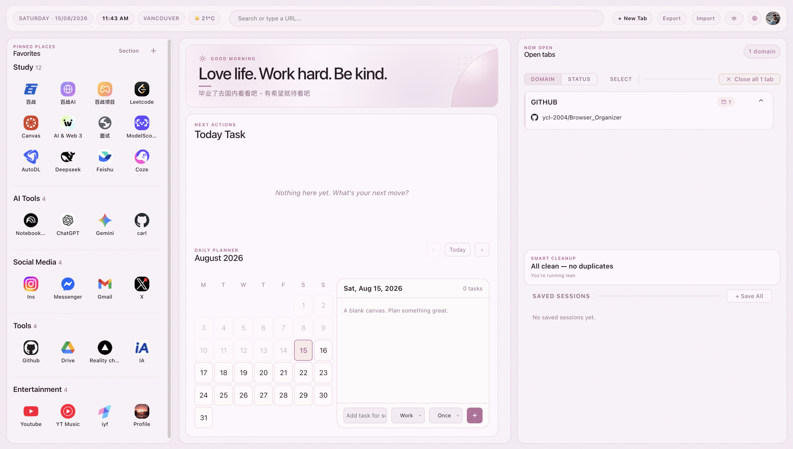

<p align="center">
  
</p>

<h1 align="center">Browser Organizer</h1>

<p align="center">
  <strong>A calm, local-first Chrome new tab for your links, tabs, and next task.</strong>
</p>

<p align="center">
  Manifest V3 · no Node.js · no build step · data stays in your Chrome profile
</p>

<p align="center">
  <a href="#quick-start">Quick start</a>
  ·
  <a href="#features">Features</a>
  ·
  <a href="#distribution">Distribution</a>
  ·
  <a href="#privacy">Privacy</a>
  ·
  <a href="#build-a-release-package">Release package</a>
</p>

<p align="center">
  
</p>

<p align="center">
  <sub>Favorites on the left, daily focus in the center, and live open tabs on the right.</sub>
</p>

Browser Organizer replaces Chrome's blank new tab with a personal dashboard. Keep
long-term favorites, today's work, and every open tab in one calm workspace —
without an account or a server.

> Browser Organizer is a Chrome extension, not a standalone macOS `.app`. A
> downloadable ZIP is possible, but Chrome still requires one manual “Load
> unpacked” step unless the extension is published in the Chrome Web Store.

## Quick start

### Install from this repository

1. Clone or download this repository.
2. Open `chrome://extensions` in Chrome.
3. Turn on **Developer mode**.
4. Click **Load unpacked**.
5. Select the `extension/` folder in this repository.
6. Open a new tab.

No Node.js, npm, account, or build step is required.

### Install from a release ZIP

1. Download and unzip `Browser-Organizer-v<version>.zip`.
2. Open `chrome://extensions` and turn on **Developer mode**.
3. Click **Load unpacked** and select the extracted folder — the folder that
   contains `manifest.json`.
4. Open a new tab to start using Browser Organizer.

On macOS, Chrome's file picker supports `Cmd+Shift+G`; on Windows/Linux, use
`Ctrl+L` to paste the folder path.

## Features

**Favorites**

- Unlimited links organized into named, collapsible sections.
- Drag to reorder, edit from the hover menu, and add custom logos by upload or
  paste.
- Favicons are fetched and cached locally after the first successful load.
- Right-click any page or link to add it to Browser Organizer.

**Focus area**

- Editable greeting, hero title, subtitle, and profile avatar.
- Today Task list with tags, recurring tasks, drag-to-reorder, and overdue
  carry-forward.
- Daily Planner calendar for planning ahead.
- Optional local weather and location display.

**Open tabs**

- Group tabs by domain or by status, with pinned tabs kept at the top.
- Mark tabs as Later or Important; favorite, pin, turn into a task, or close
  them from each tab chip.
- Detect duplicate URLs and close extras in one click.
- Select multiple tabs for batch actions and save tab collections as sessions.

**Chrome profile and backup**

- View the current profile's native Bookmarks and Reading List.
- Switch between light, dark, pink, lavender, sky, and sand themes.
- Toggle English and Chinese.
- Export and import favorites, sections, tasks, hero copy, avatar, and theme as
  JSON.
- Optional macOS Native Messaging support can mirror selected data between
  Chrome profiles on the same machine; the normal extension does not require it.

## Usage

Open a new tab and start with the three columns:

1. Add a favorite from the left column and create sections such as Work, Social,
   or Tools.
2. Add today's next action in the center, or click a date in Daily Planner to
   plan ahead.
3. Use the right column to find, tag, save, or close open tabs.
4. Use **Export** before moving to another Chrome profile; use **Import** to
   restore the backup.

The top bar also provides search/navigation, **+ New Tab**, theme, language, and
backup controls.

## Distribution

There are two practical ways to share this project:

- **Chrome Web Store — recommended for one-click installation.** Upload the ZIP
  produced by the release command below. Once published, users can install it
  directly with **Add to Chrome**. Chrome's official distribution rules say that
  direct installs on Windows and macOS must come from the Chrome Web Store.
- **GitHub Release — downloadable ZIP.** Attach the same ZIP as a release asset.
  Users can download it immediately, then follow the “Install from a release
  ZIP” steps above. This is a polished download package, but it is not a
  double-clickable desktop app.

The repository is prepared for both paths. Publishing a GitHub Release or a
Chrome Web Store item is a separate account-level action and is not performed by
the local packaging script.

See the official [Chrome distribution guide](https://developer.chrome.com/docs/extensions/how-to/distribute)
and [Chrome Web Store publishing guide](https://developer.chrome.com/docs/webstore/publish)
for the platform rules.

## Build a release package

The extension has no compile step. The packaging script reads the version from
`extension/manifest.json` and creates a ZIP with `manifest.json` at its root:

```bash
./scripts/package-extension.sh
```

Output:

```text
dist/Browser-Organizer-v1.0.0.zip
```

You can choose another output directory if needed:

```bash
./scripts/package-extension.sh release
```

The resulting ZIP contains only the installable extension. The optional
`native-host/` helper is intentionally kept outside the standard package.

## Privacy

- Favorites, tasks, themes, language, saved sessions, and cached favicon images
  are stored in `chrome.storage.local` for the current Chrome profile.
- There is no account, OAuth, analytics, advertising, or cloud sync.
- Export and Import are explicit local JSON file operations.
- Weather, location, favicon, and search suggestions may use their respective
  external services when those features are used.
- Optional same-machine profile sync writes to a local file through the
  `native-host/` helper; it is disabled when the helper is not installed.

## Project layout

```text
extension/                  Chrome Manifest V3 extension
image/Output.png            README product screenshot
scripts/package-extension.sh  Release ZIP packaging
native-host/                 Optional macOS cross-profile sync helper
```

After changing local extension files, open `chrome://extensions` and click the
reload icon for Browser Organizer. User data is preserved.

## Credits

Browser Organizer is forked from
[tab-out](https://github.com/zarazhangrui/tab-out) by
[Zara Zhang](https://x.com/zarazhangrui).

## License

[MIT](LICENSE)
